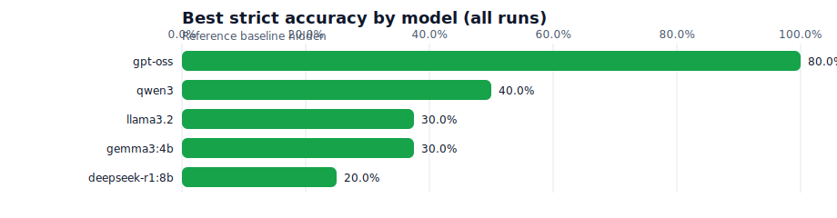

# bible-eval (Project Genesis)

Benchmark large language models for **verbatim fidelity** to public-domain Bible texts (KJV/WEB/ASV), with
metrics designed to separate:

- **Knowledge** (does the model know the verse?) from
- **Compliance** (can it output *only* the verse, with no “chatter”?)

This repo focuses on evaluating **open-source / locally hosted** models (Ollama, OpenAI-compatible servers)
but can be extended to hosted APIs.

## What it measures

- **WER** (word error rate): substitutions/deletions/insertions vs ground truth.
- **CER** (character error rate): fine-grained spelling drift.
- **Chatter ratio**: how much extra text the model adds (prefaces, commentary, etc.).
- **Fuzzy similarity**: token-sort similarity to flag paraphrase vs total miss.

## Quickstart

1) Create a venv and install:

```bash
python -m venv .venv
source .venv/bin/activate
pip install -e ".[dev]"
```

2) Run a tiny sample eval (ships with `data/raw/kjv_sample.json`):

```bash
bible-eval run --config config.yaml
```

By default, `config.yaml` uses the offline `reference` connector, so it runs without Ollama/vLLM.

3) Point `config.yaml` at a real public-domain dataset (KJV/WEB/ASV JSON) and increase `eval.sample.count`.

## Connectors

- **Ollama** (`connector: ollama`): uses `POST /api/chat` on `http://localhost:11434` by default.
- **OpenAI-compatible** (`connector: openai-compatible`): for vLLM/llama.cpp servers exposing `POST /v1/chat/completions`.

See `docs/CONNECTORS.md` and `docs/CONFIG.md`.

## Model shortlist (open-source)

If you want a starting point for verse-recall evals, see `docs/MODELS.md` for a
curated list of open-weight models that tend to be strong on instruction-following
and low-chatter output. Results vary by size, quantization, and prompt; run the
benchmark to verify.

## Data format

Raw verse JSON is expected as a list of objects:

```json
{ "book": "Genesis", "chapter": 1, "verse": 1, "text": "In the beginning..." }
```

See `docs/DATA.md` for details and normalization rules.

## CLI

- `bible-eval run --config config.yaml` writes `runs/<timestamp>/<model_slug>/results.json` and `runs/<timestamp>/summary.json`.
- `bible-eval score --gt "<text>" --pred "<text>"` prints metrics for one pair.
- `bible-eval export-site` writes `docs/data/history.json` for the landing page.

## Results + Landing Page

- Results history is saved to `results/history.json` after each run.
- A static landing page lives in `docs/` and reads `docs/data/history.json`.
- View locally: `cd docs && python -m http.server 8000`

## Results snapshot



Full results: https://migkapa.github.io/bible-evals/

To refresh the chart after new runs: `python scripts/render_readme_chart.py`.

## Development

- Tests: `pytest`
- Lint: `ruff check src tests`

## Contributing

See `CONTRIBUTING.md`. By participating, you agree to the code of conduct in
`CODE_OF_CONDUCT.md`.

## License

Code: MIT (see `LICENSE`).
Sample Bible text: Public domain (KJV).
